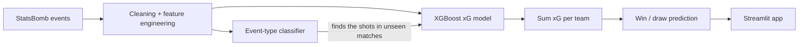
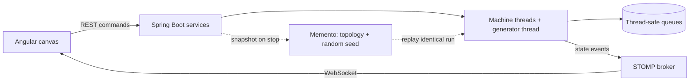

 

---

## 👋 About me

I'm a Computer Engineering student at Alexandria University who likes building things that have to actually work: ML pipelines that serves different fields, simulators, and shells and schedulers written in C.

I move between both ends of the stack, from training XGBoost models to hunting race conditions, and the most fun problems are where the two meet.

- 🎓 **B.Sc. Computer Engineering** · Alexandria University · 2023 – 2028
- 🤖 **Built and deployed** an xG model on 1.2M football events, with a [live demo](https://ai-football-match-analyst.streamlit.app/)
- ⚙️ **Wrote from scratch:** a Unix shell, a CPU scheduler, and a Redis-based distributed lock
- 🥉 **3rd place, MATE ROV International:** designed the ROV's power distribution board and the main control board of the team's underwater float (Alexandria University Robotics Club)
- 📫 **Open to internships** in AI/ML and software engineering

---

## 🌟 Featured projects

### ⚽ [AI Football Match Analyst](https://github.com/Eydo99/AI-Football-Match-Analyst) &nbsp;·&nbsp; [**Live demo →**](https://ai-football-match-analyst.streamlit.app/)

An end-to-end **expected goals (xG)** pipeline on StatsBomb open data, served through a live Streamlit app that scores matches the models have never seen.

| 🎯 xG model | 🧮 Event classifier | 🏟️ Match prediction | 📊 Data |
|:---:|:---:|:---:|:---:|
| **0.920** ROC AUC | **94.0%** accuracy | **70.2%** over 1,003 matches | **1.2M** events |

<b>How it works (click to expand)</b>

- Modular transformer-based pipeline: location splitting, imputation, distance and angle to goal, nearest defender, defenders within 3 m, ball speed.
- A second classifier recovers which events are shots on new matches, because the real `type` column would leak the answer.
- The app only lists competitions and seasons that were **not** used in training.

---

### 🏭 [SimBuilder — Real-Time Production Line Simulator](https://github.com/Eydo99/Production-Line-Simulator)

Design a factory out of queues and machines, press Start, and watch products flow through **one Java thread per machine**, live in the browser.

<b>Architecture and highlights (click to expand)</b>

- **Observer pattern** pushes every queue and machine change to the UI over WebSocket/STOMP.
- **Memento pattern** stores the topology and random seed so a run can be replayed exactly.
- **8 pre-flight rules** catch isolated nodes, dead ends and cycles before any thread starts.

---

### 📬 [Mail Project — Full-Stack Email Client](https://github.com/Eydo99/Mail-Project)

A Gmail-style mail system: **66 Java files**, **22 Angular components**, per-user JSON storage.

Design patterns in action: **Strategy** (8 sort orders), **Chain of Responsibility** (9 combinable filters), **Factory**, and **Command** (undo/redo for profile edits).

---

### 🧠 [Smart Advisor — AI Course Recommender](https://github.com/nelatawy/Course-Recommender)

Two interchangeable engines behind one **Strategy Pattern** interface: a **Prolog** logic engine for hard constraints (prerequisites, eligibility) and a **Google Gemini** engine for preference-based ranking, served through a REST API to a React Native app.

---

### 🔀 [SFGLab — Signal Flow Graph Analyzer](https://github.com/Joo-Ashraf1/Control-Systems-SFG)

Draw a signal flow graph in the browser and get every forward path, loop, non-touching loop combination and the simplified symbolic transfer function using **Mason's gain rule**. **26 pytest cases.**

---

### ⚙️ [OS Labs — Concurrency & Distributed Systems](https://github.com/Eydo99/OS_-Labs)

- A **Unix shell** with background jobs and zombie reaping
- **Multithreaded matrix multiplication** with three threading strategies
- **Caltrain synchronizer** (mutexes + condition variables), stress-tested over 1,000 runs
- **CPU scheduler simulation** (FCFS, Round Robin, HPF) using POSIX message queues and signals
- **Redlock distributed mutex** across 5 Dockerized Redis nodes with quorum and atomic Lua release

---

### 🌳 [Algorithms & Data Structures Benchmarking](https://github.com/Eydo99/DSA-Projects)

Red-Black Tree vs BST, six sorting algorithms (with a JavaFX visualizer), and Prim / Kruskal / Dijkstra / DAG shortest path, all built from scratch with **70 JUnit tests** and seeded, JIT-warmed benchmarks.

> On nearly-sorted input, a plain BST reached a height of **3,145** while the Red-Black Tree stayed at **30**, and inserted up to ~20x faster.

---

<b>🧰 More projects (click to expand)</b>

 

| Project | Stack | What it is |
|---|---|---|
| [Paint Studio](https://github.com/Eydo99/Paint-Project) | Java · Spring Boot · Angular · Konva | Vector drawing editor with 8 shape types and **server-side undo/redo** using the Command pattern, plus JSON/XML export |
| [OR Projects](https://github.com/Eydo99/OR-Projects) | Python · NumPy · Pandas | Gradient descent and Newton's method **from scratch** on a housing dataset, compared over 1,000+ iterations |
| [Numerical Methods Solver](https://github.com/Eydo99/Numerical-Project) | Python · Flask · Angular 18 | 14 methods for linear systems and root finding, with step-by-step playback, plotting and error analysis |

---

## 🛠️ Tech stack

 
 
 

| | |
|---|---|
| **🤖 AI / ML** | NumPy · Pandas · Matplotlib · Seaborn · scikit-learn · XGBoost · feature engineering · Gemini API · prompt engineering |
| **📚 ML methods** | Linear / logistic regression · decision trees · ensembles · SVM · KNN · Naive Bayes · K-Means · DBSCAN · gradient descent |
| **🌐 Backend & web** | Spring Boot · REST APIs · WebSocket / STOMP · Flask · Django · Angular · RxJS · Streamlit |
| **⚙️ Systems** | POSIX threads · mutexes & condition variables · IPC · signals · Linux · Docker · Redis |
| **🧱 Engineering** | OOP · design patterns (Strategy, Command, Observer, Memento, Factory, Chain of Responsibility) · data structures & algorithms · JUnit · pytest |
| **🔌 Hardware** | PCB design and fabrication · Arduino |

---

## 🎓 Learning & certifications

| | |
|---|---|
| 🤖 [NTI Machine Learning Summer Training](https://drive.google.com/file/d/1Az8QV0r8SDSIXWStuiR2JJ33kCE46yUg/view?usp=sharing) | Python data stack, supervised and unsupervised learning, feature selection and extraction |
| 📘 [Machine Learning — Andrew Ng](https://coursera.org/share/e6f69593c286955a3918a4d81dbb0060) | Coursera / DeepLearning.AI |
| ☁️ [AWS Cloud Foundations](https://www.credly.com/badges/aa234186-426c-400c-a06f-bdcef1134ca1/public_url) | Credly badge |
| ☁️ [AWS Cloud Architecting](https://www.credly.com/badges/3e9231b5-4394-42e8-a4f7-c3086a8611d4/public_url) | Credly badge |
| 🥉 [MATE ROV International — 3rd place](https://drive.google.com/file/d/1Qj9hFOlLR7PCRcQSb9HTkm6BjbOvvveW/view?usp=sharing) | Certificate |

---

## 📈 GitHub stats

---

## 🤝 Let's connect

Got an interesting problem in ML, concurrency, or robotics? Let's talk. I'm open to **internships in AI/ML and software engineering**.

